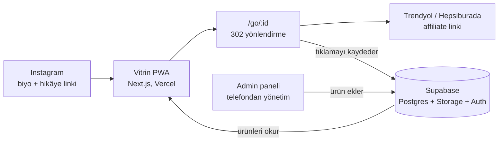

# Vitrin — Influencer Ürün Vitrini Uygulaması PRD

Tarih: 4 Ekim 2026 · Hazırlayan: Kadir

## Alınan kararlar

| Konu | Karar |
| --- | --- |
| Platform | Önce web uygulaması (PWA); mağaza uygulaması ancak düzenli geri dönen kitle oluşursa |
| Affiliate programları | Trendyol ve Hepsiburada |
| Ürün akışı | Ablan Instagram'da ne paylaşıyorsa aynı görsel ve linkle vitrine de ekler; takipçi butona dokununca doğrudan Trendyol veya Hepsiburada açılır (uygulaması yüklüyse uygulaması) |
| Görseller | Ablanın paylaştığı görselin aynısı kullanılır; yapay zekâ / sanal model (persona) görseli şimdilik yok |
| Tıklama takibi | /go/:id yönlendirmesi kullanılır; link hiç değiştirilmeden yönlendirilir, tıklama kendi panelimizde de sayılır |

## Özet ve problem

**Vitrin**, bir moda/yaşam tarzı influencer'ının Instagram hikâyelerinde paylaştığı Trendyol ve Hepsiburada affiliate (tıklama başı kazanç) linklerini kalıcı, görsel ve gezilebilir bir vitrine dönüştüren mobil öncelikli bir web uygulamasıdır. Ablan Instagram'da ne paylaşıyorsa aynı görsel ve linkle vitrine de ekler; takipçi linke tıkladıkça ablan kazanmaya devam eder. Uygulama kısa ve net: görsel, kısa not, tek buton.

**Problem:** Hikâyedeki link 24 saat sonra kaybolur. O saatlerde hikâyeyi görmeyen takipçi ürünü bulamaz, öne çıkanlar (highlights) ise karışık ve aranamaz. Sonuç: her paylaşımın tıklama ömrü bir gündür, gelir potansiyelinin büyük kısmı kaçar.

**Çözüm:** Instagram biyografisindeki tek link, tüm ürünlerin kategorilere ayrılmış ve kalıcı olduğu bir vitrine açılır. Hikâyede paylaşılan her ürün aynı anda vitrine de eklenir; hikâye bittikten aylar sonra bile tıklanabilir.

**Neden web uygulaması (PWA), mağaza uygulaması değil:** Takipçiler Instagram'dan tek dokunuşla gelir; uygulama indirmek ciddi kayıp yaratır. PWA ana ekrana eklenebilir, App Store/Play onayı ve ücreti gerektirmez, SEO ve WhatsApp paylaşımıyla da trafik getirir.

> Not: "Vitrin" geçici bir çalışma adıdır; ablanın kendi adı veya Instagram kullanıcı adı ile markalanması önerilir.

## Hedefler, başarı metrikleri ve kapsam dışı

Birincil hedef: paylaşılan her ürünün tıklama ömrünü 1 günden aylara uzatmak. Hedef rakamlar ilk 1 ay ölçüldükten sonra kesinleştirilecek; aşağıdakiler başlangıç önerisidir.

| Metrik | Nasıl ölçülür | İlk hedef (öneri) |
| --- | --- | --- |
| Aylık affiliate tıklaması | /go yönlendirme kayıtları | Hikâye tıklamalarının ≥ %30'u kadar ek tıklama |
| 24 saatten eski ürünlere gelen tıklama payı | Tıklama tarihi − ürün eklenme tarihi | ≥ %40 |
| Ziyaretçi başına ürün tıklaması | Tıklama / tekil ziyaretçi | ≥ 1,5 |
| Geri dönen ziyaretçi oranı | 30 gün içinde tekrar gelen | ≥ %25 |
| Ürün ekleme süresi (admin) | Görsel seçme + link yapıştırma → yayın | < 60 saniye |
| Sayfa açılış hızı (mobil 4G) | Lighthouse LCP | < 2,5 sn |

**Kapsam dışı (v1):**

- Uygulama içinde satış, sepet veya ödeme — satış her zaman Trendyol / Hepsiburada'da olur.
- Ziyaretçi üyeliği / giriş — favoriler cihazda tutulur.
- Instagram'dan otomatik ürün çekme — Instagram API hikâyedeki link çıkartmalarını güvenilir şekilde vermez; ürün admin panelden eklenir.
- Yapay zekâ ile görsel üretme / sanal model (persona) üzerinde ürün gösterimi.
- App Store / Play Store uygulaması.
- Birden fazla influencer (çok kiracılı yapı).

## Kullanıcılar

Uygulamanın iki kullanıcısı vardır.

**1. Ziyaretçi (takipçi):** Çoğunlukla 20–45 yaş kadın, %90+ telefondan ve Instagram uygulaması içindeki tarayıcıdan gelir. Ürünü hızlıca görmek ve tek dokunuşla mağazaya gitmek ister. Üye olmak istemez.

**2. Influencer (admin):** Tek kişi, tüm işi telefondan yapar. Hikâye paylaşırken aynı ürünü 1 dakikadan kısa sürede vitrine eklemek, hangi ürünün para kazandırdığını görmek ister. Teknik bilgisi gerekmez.

## Özellikler ve kullanıcı akışları

P0 = ilk sürümde şart, P1 = ilk ay içinde, P2 = sonraki faz.

### Ziyaretçi tarafı

| Özellik | Açıklama | Öncelik |
| --- | --- | --- |
| Vitrin akışı | Instagram tarzı 2 sütunlu görsel grid (4:5), en yeniler üstte, sonsuz kaydırma | P0 |
| "Hikâyede yeni" şeridi | Son 48 saatte eklenen ürünler en üstte yatay kaydırmalı şerit, "Yeni" rozeti | P0 |
| Ürün detayı | Ablanın Instagram'da paylaştığı görsel, kısa notu, mağaza adı (Trendyol / Hepsiburada), büyük "Ürüne Git" butonu | P0 |
| Kategoriler ve filtre | Giyim, Ayakkabı, Çanta & Aksesuar, Kozmetik & Bakım, Ev; mağazaya (Trendyol / Hepsiburada) göre filtre | P0 |
| Paylaşım | Her ürünün kendi URL'si ve WhatsApp/Instagram önizleme görseli (Open Graph) | P0 |
| Arama | Ürün adı, marka | P1 |
| Favoriler | Kalp ikonu, cihazda (localStorage) saklanır, üyelik yok | P1 |
| Video | Hikâyedeki kısa videonun da yüklenebilmesi | P2 |

### Admin tarafı (telefondan kullanım)

| Özellik | Açıklama | Öncelik |
| --- | --- | --- |
| Hızlı ürün ekleme | Instagram'da paylaştığı fotoğrafı galeriden seç + Trendyol veya Hepsiburada linkini yapıştır → mağaza otomatik tanınır → isteğe bağlı kategori ve kısa not → yayınla | P0 |
| Otomatik ürün bilgisi | Linkten ürün adı ve ürün fotoğrafı otomatik çekilir; ablan görsel yüklemezse bu fotoğraf kullanılır | P0 |
| Tıklama paneli | Bugün / 7 gün / 30 gün tıklama, en çok tıklanan 10 ürün, mağaza ve kategori bazında dağılım | P0 |
| Ürün düzenleme / arşiv | Düzenle, sırala, sabitle (üstte tut), arşivle (vitrinde gizle, link çalışmaya devam eder) | P0 |
| Hikâye için ürün linki | Her ürün için kısa link (ör. site.com/u/ab12) kopyala → hikâyede link çıkartması olarak kullan; tıklama hem kaydedilir hem vitrine trafik getirir | P1 |
| Link sağlık kontrolü | Günlük olarak tüm linkleri kontrol et; kırık veya "stokta yok" olanları admin'e bildir | P1 |

### Ana akışlar

**Admin — ürün ekleme (hedef < 60 sn):**

1. Admin panelde "+" → Instagram'da paylaştığı fotoğrafı galeriden seçer (hikâyede kullandığı görselin aynısı).
2. Trendyol veya Hepsiburada linkini yapıştırır; mağaza ve ürün adı otomatik dolar.
3. İsterse kategori seçer ve 1–2 cümlelik not yazar.
4. "Yayınla" → ürün hemen vitrinde.

**Ziyaretçi — keşif ve tıklama:**

1. Instagram biyografisindeki linke veya hikâyedeki ürün linkine dokunur.
2. Vitrinde "Hikâyede yeni" şeridini ve gridi görür, kategoriye geçer.
3. Ürüne dokunur → ablanın paylaştığı görsele ve notuna bakar.
4. "Ürüne Git" → /go/:id üzerinden kayıt alınır → orijinal affiliate linkine yönlendirilir, Trendyol / Hepsiburada (uygulaması yüklüyse uygulaması) açılır.

## Tasarım ve görsel yönergeler

His: bir moda dergisinin dijital sayfası gibi; görseller baskın, arayüz neredeyse görünmez. Referans hissi: Instagram/Pinterest grid'i + editoryal moda dergisi + LTK/ShopMy gibi influencer vitrinleri.

- **Mobil öncelikli:** Tasarım 390 px genişlikte yapılır, masaüstü ikincildir. Instagram içi tarayıcıda kusursuz çalışmalı (alt çubuk, güvenli alanlar).
- **Görsel oranı:** Grid ve detayda 4:5 dikey (Instagram ile aynı); hikâye görselleri 9:16 ise akıllı kırpma veya detayda tam boy gösterim. Görseller kenardan kenara, köşeler hafif yuvarlatılmış.
- **Renk paleti:** Kırık beyaz zemin (#FAF7F2 civarı), koyu kahve/antrasit metin, tek vurgu rengi (ablanın markasına göre; ör. pudra pembe veya terracotta).
- **Tipografi:** Başlıklarda zarif bir serif (ör. Playfair Display veya Cormorant), metinde temiz bir sans-serif (ör. Inter veya DM Sans). Türkçe karakter desteği (ğ, ş, ı, İ) test edilmeli.
- **"Ürüne Git" butonu:** Ekranın altında sabit, tam genişlik, vurgu renginde; başparmakla rahat erişim. Butonun hemen üstünde mağaza adı (Trendyol / Hepsiburada) ve küçük reklam etiketi.
- **Mikro etkileşimler:** Görsellerin yumuşak yüklenmesi (blur placeholder), favori kalbinde küçük animasyon, birden fazla görsel arasında kaydırma.
- **Performans:** Görseller AVIF/WebP, otomatik boyutlandırma, tembel yükleme. İlk görsel 2,5 sn içinde görünmeli.
- **Ablanın kimliği:** Sayfanın üstünde profil fotoğrafı, adı, kısa bir cümle ve Instagram'a geri dönüş linki. Vitrin onun kişisel butiği gibi hissettirmeli.
- **Dil:** Arayüz Türkçe; metinler samimi ve kısa ("Bunu çok sevdim", "Hikâyede yeni").
- **PWA:** manifest, uygulama simgesi, ana ekrana ekleme, tam ekran açılış.

## Teknik mimari ve veri modeli

Önerilen yığın tek kişinin yönetebileceği, aylık sabit maliyeti neredeyse sıfır olan sunucusuz bir yapıdır: Next.js + Supabase.

Ziyaretçi hiçbir zaman affiliate linkine doğrudan gitmez; önce /go uğrar, tıklama kaydedilir, ardından orijinal link açılır.

### Teknoloji yığını

| Katman | Seçim | Neden |
| --- | --- | --- |
| Ön yüz + sunucu | Next.js (App Router), TypeScript, Tailwind CSS | SEO, hızlı sayfa, Claude ile en iyi bilinen yığın |
| Barındırma | Vercel (ücretsiz/hobby ile başla) | Tek tıkla yayın, görsel optimizasyonu, otomatik HTTPS |
| Veritabanı, görseller, giriş | Supabase (Postgres + Storage + Auth) | Ücretsiz katman yeterli; admin girişi e-posta sihirli link ile |
| Ürün bilgisi çekme | Sunucuda Open Graph + JSON-LD (Product) okuma | Linkten ürün adı ve fotoğraf otomatik |
| Analitik | Kendi tıklama tablosu + Vercel Analytics | Çerez gerektirmeyen ölçüm |
| Zamanlanmış işler | Vercel Cron | Günlük link sağlık kontrolü |

### Veri modeli

| Tablo | Ana alanlar |
| --- | --- |
| products | id, slug, title, store (trendyol / hepsiburada), affiliate_url, image_url (ablanın yüklediği görsel), fallback_image_url (linkten çekilen), category, note, is_gift, is_pinned, status (taslak/yayında/arşiv), created_at |
| clicks | id, product_id, source (vitrin/hikâye/paylaşım), referrer, device, country, ip_hash, is_bot, created_at |
| link_checks | id, product_id, http_status, in_stock, checked_at |

### Mağaza tanıma

- affiliate_url'nin alan adından (kısaltılmış link ise yönlendirme hedefinden) mağaza tespit edilir: Trendyol veya Hepsiburada.
- Tanınamayan link için admin mağazayı elle seçer. Veri modeli ileride başka mağazalar eklenebilecek şekilde esnek tutulur.

### Tıklama takibi kuralları

- /go/:id bir sunucu rotasıdır: tıklamayı kaydeder ve **302** ile orijinal affiliate linkine yönlendirir. Hedef: < 150 ms.
- Affiliate linki **hiçbir şekilde değiştirilmez**; içindeki takip parametreleri olduğu gibi korunur. Aksi halde ablanın kazancı kaybolabilir.
- Kayıt yönlendirmeyi bekletmez (arka planda yazılır); kayıt başarısız olsa bile yönlendirme çalışır.
- Botlar (Instagram link önizleme tarayıcısı vb.) user-agent ile filtrelenip ayrı sayılır.
- IP adresi saklanmaz, yalnızca tuzlanmış hash tutulur (tekil ziyaretçi sayımı için).
- Hikâyeye konan kısa link ?s=story parametresiyle gelir; böylece hikâye ile vitrin tıklamaları ayrı raporlanır.

## Yasal uyumluluk

Affiliate linkle kazanç sağlanan her ürün ticari reklam sayılır ve bu, vitrinde de açıkça belirtilmelidir. Uygulama bunu otomatik yapmalı ki ablanın unutma ihtimali olmasın. (Hukuki danışmanlık değildir; yayına çıkmadan önce bir avukata kısa bir kontrol yaptırılması önerilir.)

**Reklam etiketi (zorunlu, P0):**

- Ticaret Bakanlığı'nın 2021'de yayımlanan [Sosyal Medya Etkileyicileri Kılavuzu](https://www.aa.com.tr/tr/ekonomi/ticaret-bakanligi-influencerlar-icin-kilavuz-yayimladi/2232465), maddi kazanç sağlanan paylaşımların reklam olduğunun açıkça belirtilmesini zorunlu kılar ve örtülü reklamı yasaklar.
- Kılavuzda kabul edilen ifadeler arasında #Reklam, #İşbirliği, #Ortaklık, #Sponsor bulunur ([kaynak](https://moral.av.tr/tr/hukuki-haberler/sosyal-medya-etkileyicileri-influencer-tarafindan-yapilan-ticari-reklam-ve-uygulamalar-hakkinda-kilavuz-yayimlandi-508)).
- Reklam Kurulu, reklam olduğu belirtilmeden paylaşılan linklere yönlendirmeyi örtülü reklam sayarak ceza vermiştir ([kaynak](https://www.lexology.com/library/detail.aspx?g=04bccf36-2dee-43c0-ba0f-06697707b893)).
- Etiket, ilk bakışta görülebilir, zeminden ayırt edilebilir ve okunabilir boyutta olmalı; Türkçe kullanılmalı (yalnızca #ad yetersiz kabul edilebilir).

**Uygulamadaki karşılığı:**

- Her ürün kartında ve ürün detayında, "Ürüne Git" butonunun yanında okunaklı **"#Reklam · [Trendyol / Hepsiburada] ortaklık linki"** etiketi. Admin bunu kapatamaz.
- Sayfanın üstünde ve altında kalıcı bilgi notu: "Bu sayfadaki linkler satış ortaklığı (affiliate) linkleridir; tıklamalarınızdan gelir elde edebilirim."
- Ürün bir markanın hediyesiyse admin "hediye" işaretler → etiket "@Marka tarafından hediye olarak alındı" olur.

**Görsel hakları:**

- Ablanın kendi çektiği/paylaştığı görseller onundur. Linkten otomatik çekilen ürün fotoğrafları mağazaya/markaya aittir; affiliate programlarının görsel kullanım şartları yayın öncesi kontrol edilir.

**KVKK ve çerezler:**

- Ziyaretçiden hiçbir kişisel veri istenmez; IP saklanmaz, yalnızca hash'i tutulur. Çerezsiz analitik kullanılırsa çerez onay penceresine gerek kalmaz.
- Basit bir Gizlilik ve Aydınlatma Metni sayfası bulunur.

## Yol haritası

Uygulama 2 fazda yapılır; her faz sonunda ablan gerçekten kullanır, geri bildirimle sonraki faza geçilir.

1. **Faz 1 — Çalışan vitrin (MVP):** Vitrin akışı, "Hikâyede yeni" şeridi, ürün detay, kategoriler, /go tıklama takibi, admin girişi, hızlı ürün ekleme (görsel + link), reklam etiketleri, tıklama paneli, PWA (ana ekrana ekleme).
2. **Faz 2 — İyileştirmeler:** Arama, favoriler, hikâye için kısa linkler, link sağlık kontrolü, video desteği.

Şimdilik kapsam dışı: yapay zekâ ile sanal modeller (persona) üzerinde ürün gösterimi. Vitrin oturduktan sonra ayrıca değerlendirilebilir.

## Claude Code için çalışma talimatları

- Her fazı ayrı ayrı yap; bir faz bitmeden diğerine geçme.
- Başlamadan önce anlamadığın veya karar gerektiren noktaları sor.
- Kapsamı genişletme: yapay zekâ görsel üretimi, persona, ödeme veya üyelik ekleme.
- Affiliate linklerini asla değiştirme, kısaltma veya parametrelerini silme.
- Arayüz Türkçe ve mobil öncelikli olsun; Instagram içi tarayıcıda test edilecek.
- Veritabanı şemasını SQL migration olarak yaz; Supabase Row Level Security ile yalnızca admin yazabilsin, herkes yayındaki ürünleri okuyabilsin.
- Gizli anahtarlar (Supabase service key) yalnızca sunucu tarafında, .env dosyasında dursun; .env.example oluştur.
- Her faz sonunda yerelde nasıl çalıştırılacağını ve Vercel'e nasıl yayınlanacağını adım adım anlat.

Gerekli hesaplar: GitHub, Vercel, Supabase projesi (URL + anon key + service key), ablanın Trendyol ve Hepsiburada affiliate linklerinden 5–10 örnek ve bunlara ait Instagram görselleri.

## Açık sorular

- [ ] Trendyol ve Hepsiburada affiliate programlarının şartları /go üzerinden yönlendirmeye izin veriyor mu? (Yayından önce kontrol edilecek.)
- [ ] Uygulamanın adı ve alan adı ne olacak (ablanın adı/kullanıcı adı önerilir)?
- [ ] Fiyat gösterilsin mi? Fiyatlar sık değiştiği için "yaklaşık" ibaresiyle mi, hiç gösterilmeden mi?
- [ ] Mevcut eski hikâye linkleri (öne çıkanlar) toplu olarak içeri aktarılmak isteniyor mu?
- [ ] Kategoriler (Giyim, Ayakkabı, Çanta & Aksesuar, Kozmetik & Bakım, Ev) ablanın paylaşımlarına uyuyor mu?

## Kaynaklar

- [AA — Ticaret Bakanlığı influencer kılavuzu](https://www.aa.com.tr/tr/ekonomi/ticaret-bakanligi-influencerlar-icin-kilavuz-yayimladi/2232465)
- [Kılavuzdaki etiket ifadeleri](https://moral.av.tr/tr/hukuki-haberler/sosyal-medya-etkileyicileri-influencer-tarafindan-yapilan-ticari-reklam-ve-uygulamalar-hakkinda-kilavuz-yayimlandi-508)
- [Lexology — Reklam Kurulu kararları ve link paylaşımı](https://www.lexology.com/library/detail.aspx?g=04bccf36-2dee-43c0-ba0f-06697707b893)
